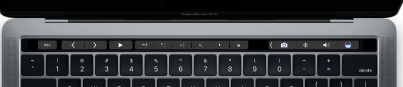

# Nasc's Macbook Pro Touch Bar features for VSCode

This adds a few useful features to your Macbook Pro's touch bar while you are working in VSCode.

## Features

This is how your touchbar will look like:

The list of features are:

- Go to definition
- Add cursor above
- Add cursor below
- Run command
- Toggle side bar
- Toggle Pannel/terminal
- Rename/replace all

## Settings

You can choose the buttons by setting the following settings.  
Please have in mind the limit of 6 active buttons (if you have the OS controll strip enabled, 9 buttons if you don't) . More than that will break the layout and the buttons will not be visible.

- "nasc-touchbar.goToDefinition": (default _true_) Go to the function or variable definition
- "nasc-touchbar.addCursorAbove": (default _false_) Add a cursor in the line above
- "nasc-touchbar.addCursorBelow": (default _true_) Add a cursor in the line below
- "nasc-touchbar.toggleSidebar": (default _false_) Toggles the sidebar
- "nasc-touchbar.togglePanel": (default _true_) Toggles the panel in the bottom of the editor
- "nasc-touchbar.showCommands": (default _true_) Shows the _run command_ prompt
- "nasc-touchbar.rename": (default _true_) Rename (replace all) variable or function names
